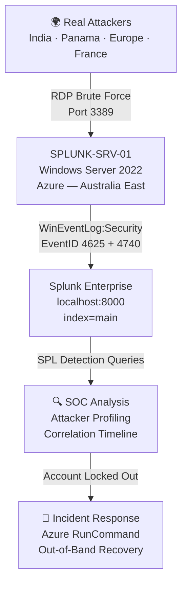

# 🔎 Splunk SOC Detection Lab — Brute-Force Attack Correlation
### *28,963 events ingested. 4 attacker IPs across 3 countries. One account locked out. Full IR executed.*

<p align="left">
  
  
  
  
  
  
</p>

---

## ⚡ TL;DR — Key Metrics

| Metric | Result |
|--------|--------|
| **Events Ingested** | 28,963+ Windows Security Events |
| **Attacker IPs Isolated** | 4 distinct IPs across 3 countries |
| **Attack Correlation Built** | EventID 4625 (Failed Login) → 4740 (Account Lockout) |
| **Incident Response** | Emergency account unlock via Azure RunCommand |
| **MITRE Techniques** | T1110 Brute Force · T1078 Valid Accounts |
| **Platform** | Splunk Enterprise — self-hosted on Azure (Windows Server 2022) |

---

## 📖 What This Project Is

This lab simulates a real-world SOC analyst workflow — from deploying standalone Splunk Enterprise infrastructure on Azure to detecting and correlating active brute-force attacks against an internet-exposed Windows Server 2022 host.

Unlike managed SIEM deployments, this lab required hands-on infrastructure management: installing Splunk natively on Windows Server, configuring local log ingestion, writing SPL detection queries from scratch, and executing a live incident response when the attacker actually succeeded in locking out the admin account.

> **This is not a simulation. The attackers are real. The lockout was real. The IR was real.**

---

## 🏗️ Architecture



---

## 🛠️ Tech Stack

| Component | Technology | Detail |
|-----------|-----------|--------|
| **SIEM** | Splunk Enterprise v10.4.0 | Self-hosted on Windows Server 2022 |
| **Cloud** | Microsoft Azure | Australia East region |
| **Log Source** | WinEventLog:Security | Native Windows Security Event log |
| **Key Event IDs** | 4625, 4740, 4688 | Failed login, lockout, process creation |
| **Query Language** | SPL (Splunk Processing Language) | Custom detection queries |
| **IR Tool** | Azure RunCommand | Out-of-band PowerShell execution |
| **MITRE ATT&CK** | T1110, T1078 | Brute Force, Valid Accounts |

---

## 🚀 Build Phases

### Phase 1 — Infrastructure Deployment

Windows Server 2022 VM deployed in **Azure Australia East** as the lab environment. RDP access established to `SPLUNK-SRV-01` for hands-on configuration.


---

### Phase 2 — Splunk Enterprise Setup

Splunk Enterprise v10.4.0 downloaded and installed natively on the Windows Server — not a cloud-managed instance. Full infrastructure ownership: installation, service configuration, port management, and web UI access on `localhost:8000`.


---

### Phase 3 — Data Ingestion

Configured Splunk to ingest **local Windows Security Event logs** in real-time using the native `WinEventLog:Security` source type. After exposing the VM to RDP traffic, **28,963+ events** were ingested within the observation window.

```
[WinEventLog://Security]
index = main
disabled = false
```


---

### Phase 4 — Detection Engineering

#### Baseline Verification (Pre-Attack)
Initial detection query returned **zero results** — confirming no brute-force activity before RDP exposure. This baseline is critical: it proves the detections are firing on real activity, not noise.


---

#### Detection 1 — Brute Force by Source IP `MITRE: T1110.001`

```spl
index=main sourcetype="WinEventLog:Security" EventCode=4625
| stats count by Source_Network_Address, Account_Name, ComputerName
| sort - count
| rename count as "Failed_Login_Attempts"
```

> **Query design note:** `index=main` is explicitly specified rather than `index=*`. Wildcarding the index forces Splunk to search across all data buckets — a performance anti-pattern that enterprise SOC teams actively prohibit. Since `inputs.conf` routes all Security Events to `index=main`, scoping the search here is both accurate and efficient.

> **Threshold rationale:** No threshold applied here — the goal was full attacker profiling. Sorting by count surfaces the highest-velocity attackers immediately without suppressing lower-frequency actors that may be running slower, stealthier sprays.

**Result:** 4 distinct attacker IPs identified across 3 countries.

| Source IP | Country | Failed Attempts | Targeted Accounts |
|-----------|---------|-----------------|-------------------|
| `163.47.70.77` | 🇮🇳 India | 16 | SPLUNKVM, admin email |
| `190.2.155.233` | 🇵🇦 Panama | 12 | SPLUNKVM |
| `195.242.214.36` | 🇪🇺 Europe | 4 | SPLUNKVM |
| `86.254.114.246` | 🇫🇷 France | 2 | Test |


---

#### Detection 2 — Brute Force → Account Lockout Lifecycle `MITRE: T1110 → T1078`

Correlating EventID 4625 (Failed Login) with EventID 4740 (Account Locked Out) reconstructs the full attack chain — from first attempt to successful lockout.

```spl
index=main sourcetype="WinEventLog:Security" (EventCode=4625 OR EventCode=4740)
| eval Status=if(EventCode==4625, "Failed Login", "Account Locked")
| table _time, Status, Account_Name, Source_Network_Address, ComputerName
| sort - _time
```

**Result:** 18 correlated events. The exact moment `SPLUNK-SRV-01$` was locked out is visible in the timeline — the attack succeeded.


---

### Phase 5 — Live Incident Response

The attack didn't just trigger alerts — it succeeded. The admin account was locked out, blocking legitimate access to the machine.

**The Problem:** Standard password reset requires logging in. The attacker's lockout had broken that path.

**The Solution:** Azure **RunCommand** — an out-of-band PowerShell execution channel that bypasses the OS login screen entirely, operating at the Azure fabric layer.

> **RBAC requirement:** Executing RunCommand requires the **Virtual Machine Contributor** role (or higher) on the target VM. This is a privileged operation — in a production environment it would be gated behind Privileged Identity Management (PIM) with just-in-time access approval, ensuring the out-of-band recovery channel itself can't be abused.

```powershell
net user SPLUNKVM [REDACTED_NEW_PASSWORD]
```


> **SOC Lesson:** Attacker-induced account lockouts are a self-inflicted denial-of-service. Every SOC playbook needs an out-of-band recovery channel — Azure RunCommand, Bastion, or Serial Console. If your only recovery path requires the compromised login, you have no recovery path.

---

## 🧠 Key Findings & Lessons Learned

### 1. The Attack Succeeded — And That's the Point
Most labs show detections firing on simulated data where nothing actually breaks. In this lab, the attacker locked out the admin account. That failure made the IR phase real — out-of-band recovery isn't a theoretical concept here, it's a documented execution.

### 2. Cross-Platform Field Mapping — SPL vs KQL
Windows Security Event fields use different names across Splunk and Microsoft Sentinel. Writing detections across both platforms requires knowing these mappings precisely — this is a real engineering skill, not a copy-paste exercise.

| Field Concept | Splunk SPL | Microsoft Sentinel KQL |
|--------------|-----------|----------------------|
| Source IP address | `Source_Network_Address` | `IpAddress` |
| Target account name | `Account_Name` | `TargetUserName` |
| Event code | `EventCode` | `EventID` |
| Timestamp | `_time` | `TimeGenerated` |
| Computer name | `ComputerName` | `Computer` |

> This mapping table was built hands-on during the [Dual SIEM Detection Lab](https://github.com/shank078/Dual-SIEM-Detection-Lab) — where identical detections were written in both SPL and KQL simultaneously.

### 3. Self-Hosted SIEM = Real Infrastructure Ownership
Unlike Sentinel (fully managed SaaS), Splunk Enterprise required: VM provisioning, Splunk installation, service configuration, port management, index creation, and ongoing maintenance. This is closer to what enterprise SOC teams running on-premise or hybrid Splunk deployments actually manage.

---

## 🔮 What's Next

- [ ] Integrate **AbuseIPDB / VirusTotal** threat intel feeds via Splunk lookups — enrich attacker IP table with known-bad reputation scores
- [ ] Build a **real-time SOC dashboard** — map attacker IPs geographically, track event velocity by EventCode
- [ ] Configure **Splunk Alert Actions** — auto-push malicious IPs to Azure NSG deny list on threshold breach
- [ ] Add full **MITRE ATT&CK mapping** across all EventIDs ingested
- [ ] **🤖 Pilot AI-Driven Triage** — use **IBM watsonx Orchestrate** to autonomously classify alert severity and enrich attacker profiles before routing to the SOC queue

---

## 📁 Repository Structure

```
splunk-soc-detection-lab/
├── spl-queries/
│   ├── 01-brute-force-by-source-ip.spl
│   └── 02-attack-lifecycle-correlation.spl
├── configs/
│   └── inputs.conf
├── docs/
│   └── lessons-learned.md
├── screenshots/
│   ├── 01_azure_vm_deployment_success.png
│   ├── 02_rdp_server_manager_access.png
│   ├── 03_splunk_enterprise_installation.png
│   ├── 04_splunk_web_dashboard_login.png
│   ├── 05_winventlog_data_input_configured.png
│   ├── 06_winventlog_ingestion_verification.png
│   ├── 07_baseline_detection_no_attacks.png
│   ├── 08_bruteforce_detection_top_attackers.png
│   ├── 09_attack_lifecycle_correlation_timeline.png
│   └── 10_incident_response_account_unlock.png
└── README.md
```

---

## 🔗 Related Projects

| Project | Description |
|---------|-------------|
| [Dual SIEM Detection Lab](https://github.com/shank078/Dual-SIEM-Detection-Lab) | Same detections rebuilt in both KQL and SPL — cross-platform parity on live traffic |
| [Azure Sentinel Honeypot SIEM](https://github.com/shank078/azure-sentinel-honeypot-siem) | 1,400+ real brute-force attempts captured and mapped globally |
| [SOAR Pipeline — Sentinel to Jira](https://github.com/shank078/azure-sentinel-jira-soar-pipeline) | Zero-touch automated incident ticketing |

---

## 👤 About the Author

**Shankar Baral** — Junior Cyber Security Analyst & IT Support Specialist
Master of Information Technology (Cyber Security) · GPA 4.92 · Australian Permanent Resident · Canberra, ACT

[](https://linkedin.com/in/shankarbaral1)
[](https://github.com/shank078)
[](mailto:shankarbaral1@gmail.com)

*Open to Junior SOC Analyst and Security Engineer opportunities in Australia.*

---

> *Most labs show attacks that fail cleanly. This one shows what happens when the attacker wins — and what a real recovery looks like.*
