# Splunk SOC Detection Lab — Brute-Force Attack Correlation

### Standalone Splunk Enterprise on Azure — real RDP brute-force attacks detected, correlated to an account lockout, and recovered out-of-band.

<p align="left">
  
  
  
  
  
  
</p>

**Full write-up:** [PROJECT_REPORT.md](PROJECT_REPORT.md) · [methodology](docs/methodology.md) · [lessons learned](docs/lessons_learned.md)

---

## TL;DR — Key Metrics

| Metric | Result |
|--------|--------|
| **Events Ingested** | 28,963+ Windows Security Events (total volume) |
| **Attacker IPs Isolated** | 4 distinct IPs across 3 countries |
| **Attack Correlation Built** | EventID 4625 (Failed Login) → 4740 (Account Lockout) |
| **Incident Response** | Emergency account unlock via Azure RunCommand |
| **MITRE Techniques** | T1110 Brute Force · T1078 Valid Accounts |
| **Platform** | Splunk Enterprise — self-hosted on Azure (Windows Server 2022) |

The 28,963 is the total Windows Security event volume Splunk ingested — the point of that number is that the pipeline was handling all Security events, not that there were 29k attacks. The brute-force attempts themselves are the per-IP counts in the [attacker table](#detection-1--brute-force-by-source-ip-mitre-t1110001) below.

---

## What This Project Is

This lab is a SOC analyst workflow end to end: standing up standalone Splunk Enterprise on Azure, then detecting and correlating brute-force attacks against an internet-exposed Windows Server 2022 host.

Unlike a managed SIEM, this meant hands-on infrastructure: installing Splunk natively on Windows Server, configuring local log ingestion, writing the SPL detections from scratch, and running a live incident response when the attacker actually locked out the admin account. The attackers, the lockout, and the recovery were all real, not simulated.

---

## Architecture

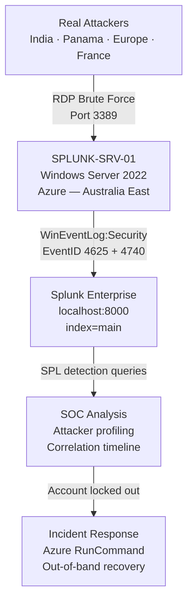

---

## Tech Stack

| Component | Technology | Detail |
|-----------|-----------|--------|
| **SIEM** | Splunk Enterprise v10.4.0 | Self-hosted on Windows Server 2022 |
| **Cloud** | Microsoft Azure | Australia East region |
| **Log Source** | WinEventLog:Security | Native Windows Security Event log |
| **Key Event IDs** | 4625, 4740, 4688 | Failed login, lockout, process creation |
| **Query Language** | SPL (Splunk Processing Language) | Custom detection queries — [`spl-queries/`](spl-queries/) |
| **IR Tool** | Azure RunCommand | Out-of-band PowerShell execution |
| **MITRE ATT&CK** | T1110, T1078 | Brute Force, Valid Accounts |

---

## Build Phases

### Phase 1 — Infrastructure Deployment

Windows Server 2022 VM deployed in **Azure Australia East** as the lab environment. RDP access established to `SPLUNK-SRV-01` for hands-on configuration.

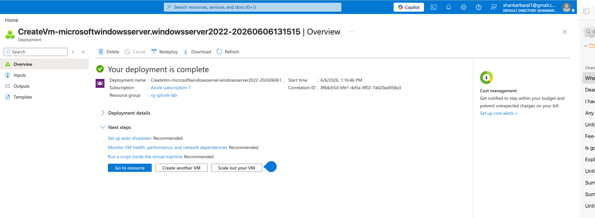

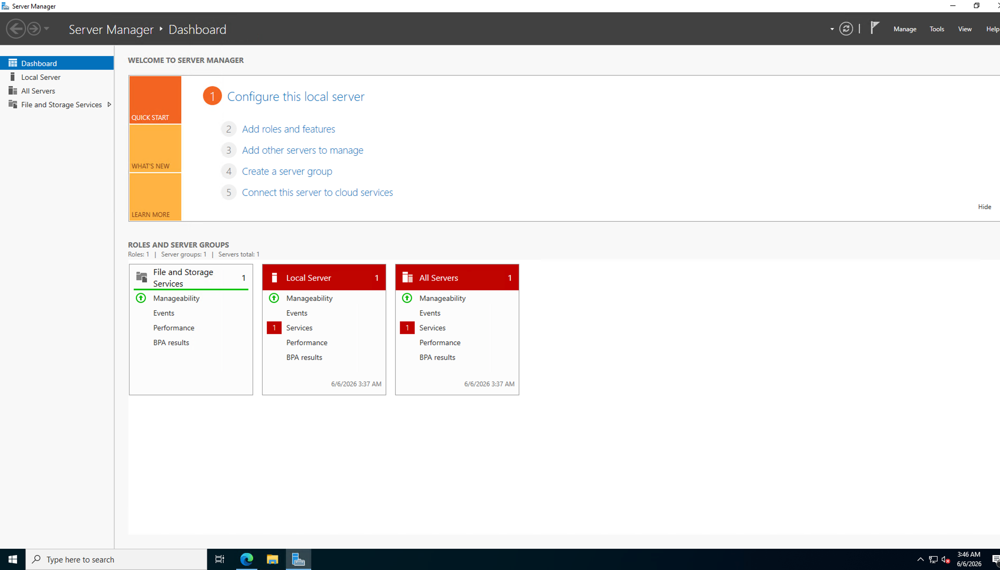

---

### Phase 2 — Splunk Enterprise Setup

Splunk Enterprise v10.4.0 downloaded and installed natively on the Windows Server — not a cloud-managed instance. That meant owning the whole setup: installation, service configuration, port management, and the web UI on `localhost:8000`.

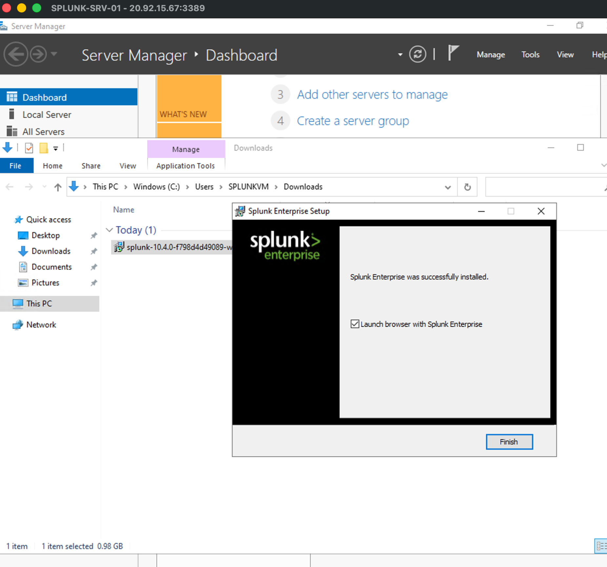

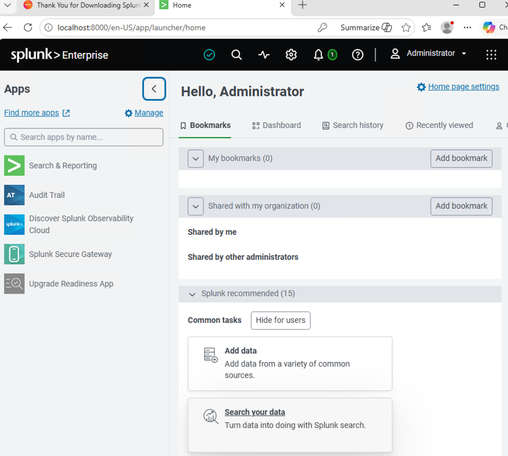

---

### Phase 3 — Data Ingestion

Configured Splunk to ingest **local Windows Security Event logs** in real time using the native `WinEventLog:Security` source type. After exposing the VM to RDP traffic, 28,963+ Security events were ingested within the observation window. Full config: [`configs/inputs.conf`](configs/inputs.conf).

```
[WinEventLog://Security]
index = main
disabled = 0
```

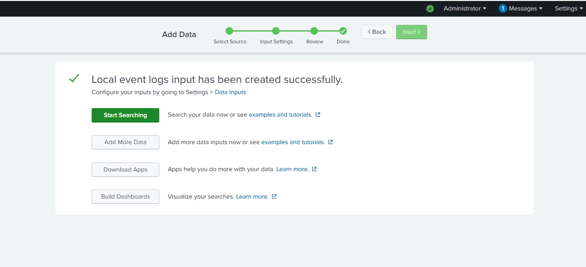

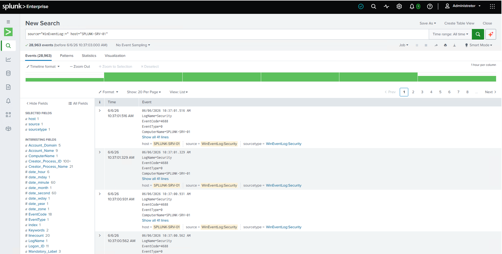

---

### Phase 4 — Detection Engineering

#### Baseline Verification (Pre-Attack)
The detection query returned **zero results** before RDP exposure — confirming no brute-force activity in the baseline. This matters: it proves the detections fire on real activity, not noise.

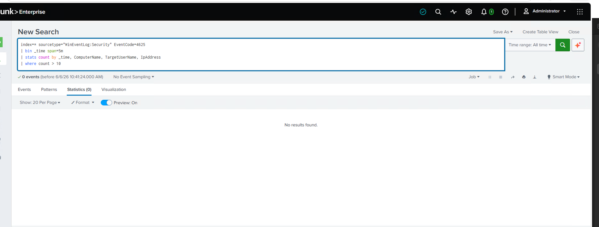

---

#### Detection 1 — Brute Force by Source IP &nbsp; `MITRE: T1110.001`

```spl
index=main sourcetype="WinEventLog:Security" EventCode=4625
| stats count by Source_Network_Address, Account_Name, ComputerName
| sort - count
| rename count as "Failed_Login_Attempts"
```

> **Query design note:** the search is scoped to `index=main` rather than `index=*`. Wildcarding the index makes Splunk search every data bucket, which is a performance anti-pattern. Since `inputs.conf` routes all Security Events to `index=main`, scoping here is both accurate and efficient, and the committed `.spl` files use `index=main` to match. (The result screenshots show earlier interactive runs; the committed `.spl` files are the tightened versions — scoped to `index=main` and using the correct Splunk field names from the mapping table below.)

> **Threshold rationale:** no threshold on this one — the goal was full attacker profiling. Sorting by count surfaces the highest-velocity attackers first without hiding lower-frequency actors running slower, stealthier sprays.

**Result:** 4 distinct attacker IPs across 3 countries.

| Source IP | Country (approx.) | Failed Attempts | Targeted Accounts |
|-----------|-------------------|-----------------|-------------------|
| `163.47.70.77` | India | 16 | SPLUNKVM, admin email |
| `190.2.155.233` | Panama | 12 | SPLUNKVM |
| `195.242.214.36` | Europe | 4 | SPLUNKVM |
| `86.254.114.246` | France | 2 | Test |

*Geolocation is approximate — the same IP can resolve to different countries across geo-IP databases and over time, so treat country as an indicator rather than fact.*

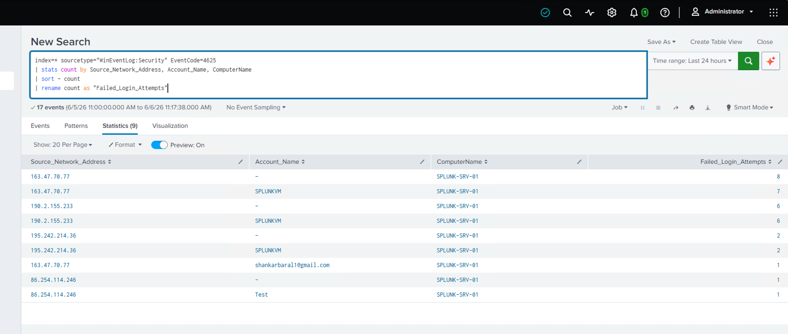

---

#### Detection 2 — Brute Force → Account Lockout Lifecycle &nbsp; `MITRE: T1110 → T1078`

Correlating EventID 4625 (Failed Login) with EventID 4740 (Account Locked Out) reconstructs the full chain — from first attempt to the lockout it caused.

```spl
index=main sourcetype="WinEventLog:Security" (EventCode=4625 OR EventCode=4740)
| eval Status=if(EventCode==4625, "Failed Login", "Account Locked")
| table _time, Status, Account_Name, Source_Network_Address, ComputerName
| sort - _time
```

**Result:** 18 correlated events. The exact moment the `SPLUNKVM` account was locked out is visible on the timeline — the attack succeeded.

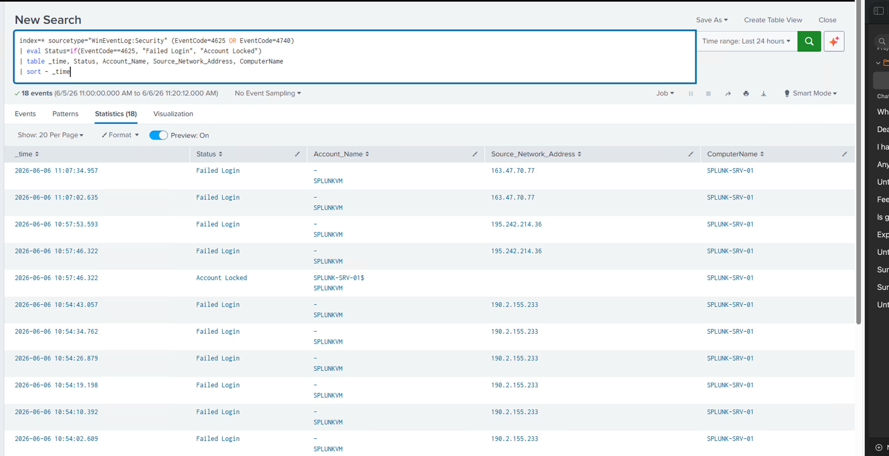

---

### Phase 5 — Live Incident Response

The attack didn't just trigger alerts — it succeeded. The admin account was locked out, blocking legitimate access to the machine.

**The problem:** a standard password reset requires logging in, and the lockout had broken that path.

**The fix:** Azure **RunCommand** — an out-of-band PowerShell channel that runs at the Azure fabric layer and bypasses the OS login screen entirely.

> **RBAC requirement:** RunCommand needs the **Virtual Machine Contributor** role (or higher) on the target VM. That's a privileged operation — in production it should be gated behind Privileged Identity Management (PIM) with just-in-time approval, so the recovery channel itself can't be abused.

```powershell
net user SPLUNKVM [REDACTED_NEW_PASSWORD]
```

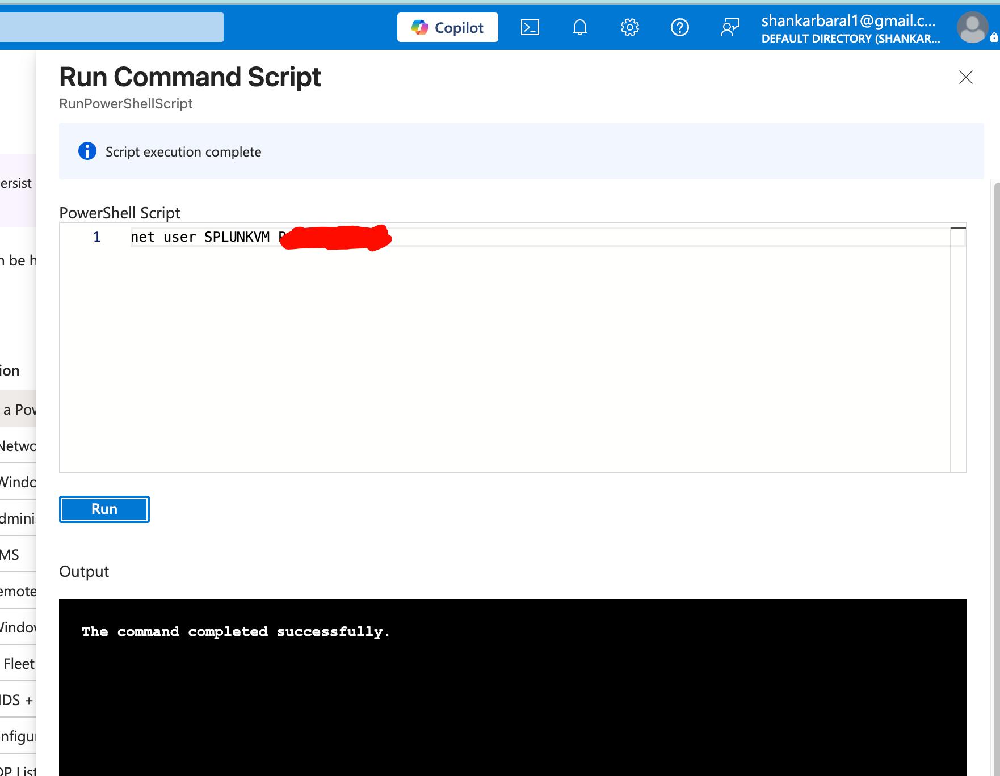

> **The takeaway:** an attacker-induced lockout is a self-inflicted denial of service. Every SOC playbook needs an out-of-band recovery channel — RunCommand, Bastion, or Serial Console. If the only recovery path runs through the compromised login, there is no recovery path.

---

## Key Findings & Lessons Learned

### 1. The attack succeeded, and that's the point
Most labs show detections firing on simulated data where nothing actually breaks. Here the attacker locked out the admin account, which made the IR phase real — out-of-band recovery isn't a concept in this repo, it's a documented execution.

### 2. SPL vs KQL field mapping
Windows Security Event fields have different names in Splunk and Microsoft Sentinel. Writing the same detection across both means knowing these mappings precisely:

| Field | Splunk SPL | Microsoft Sentinel KQL |
|-------|-----------|----------------------|
| Source IP address | `Source_Network_Address` | `IpAddress` |
| Target account name | `Account_Name` | `TargetUserName` |
| Event code | `EventCode` | `EventID` |
| Timestamp | `_time` | `TimeGenerated` |
| Computer name | `ComputerName` | `Computer` |

> I built this table hands-on during the [Dual SIEM Detection Lab](https://github.com/shank078/Dual-SIEM-Detection-Lab), where the same detections were written in both SPL and KQL at once.

### 3. Self-hosted Splunk means real infrastructure ownership
Unlike Sentinel (managed SaaS), Splunk Enterprise needed VM provisioning, installation, service and port configuration, index creation, and upkeep — closer to what a team running on-prem or hybrid Splunk actually manages day to day.

---

## What's Next

- [ ] Integrate **AbuseIPDB / VirusTotal** threat-intel feeds via Splunk lookups to tag the attacker IPs with reputation scores
- [ ] Build a **real-time SOC dashboard** — map attacker IPs, track event velocity by EventCode
- [ ] Configure **Splunk alert actions** — push malicious IPs to an Azure NSG deny list on threshold breach
- [ ] Extend the **MITRE ATT&CK mapping** across more of the ingested EventIDs

---

## Repository Structure

```
Splunk-SOC-Detection-Lab/
├── README.md
├── PROJECT_REPORT.md                     # full technical write-up
├── spl-queries/
│   ├── 01_bruteforce_detection.spl
│   ├── 02_attack_lifecycle_correlation.spl
│   └── 03_baseline_verification.spl
├── configs/
│   └── inputs.conf
├── docs/
│   ├── methodology.md
│   └── lessons_learned.md
└── screenshots/                          # 10 screenshots — build, detection, correlation, IR
```

---

## Related Projects

| Project | Description |
|---------|-------------|
| [Dual SIEM Detection Lab](https://github.com/shank078/Dual-SIEM-Detection-Lab) | The same detections rebuilt in both KQL and SPL — cross-platform parity on live traffic |
| [Azure Sentinel Honeypot SIEM](https://github.com/shank078/azure-sentinel-honeypot-siem) | 1,400+ real brute-force attempts captured and mapped globally |
| [SOAR Pipeline — Sentinel to Jira](https://github.com/shank078/azure-sentinel-jira-soar-pipeline) | Automated incident ticketing from Sentinel |

---

## About

Built and documented by **Shankar Baral** — junior SOC analyst in Canberra, Australia. More about me and my other labs: [github.com/shank078](https://github.com/shank078) · [LinkedIn](https://www.linkedin.com/in/shankarbaral1)
